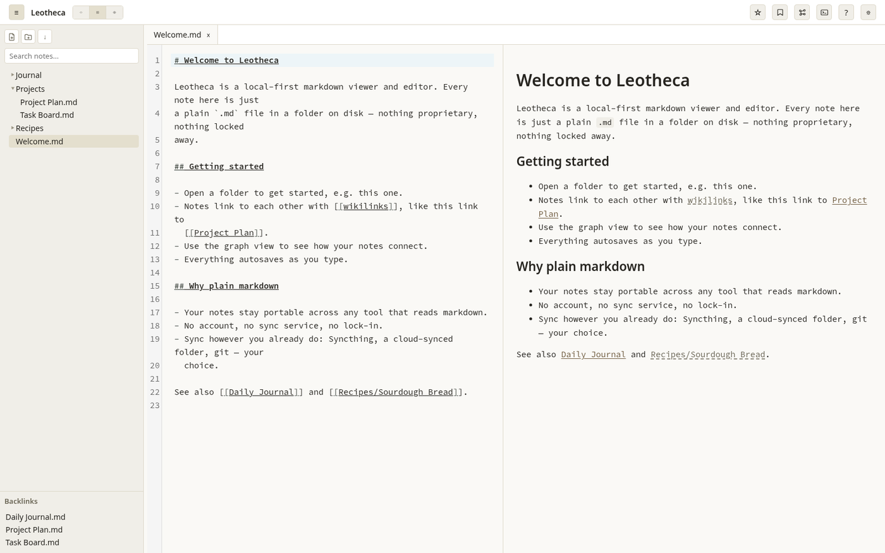
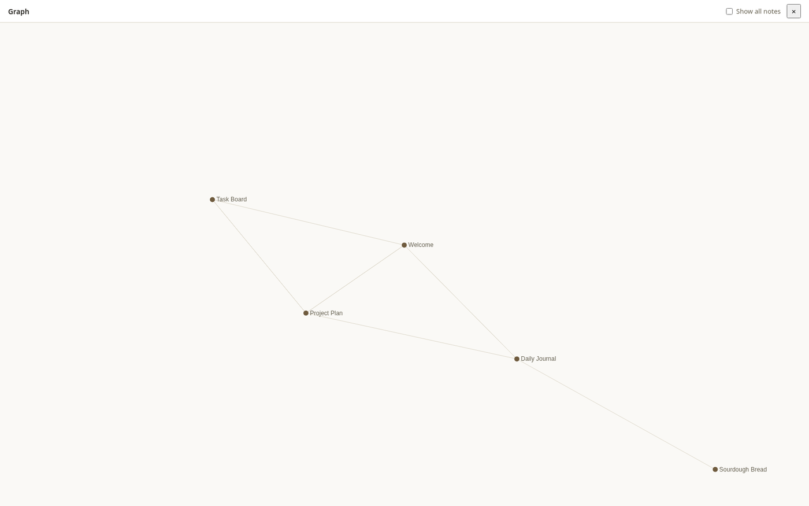
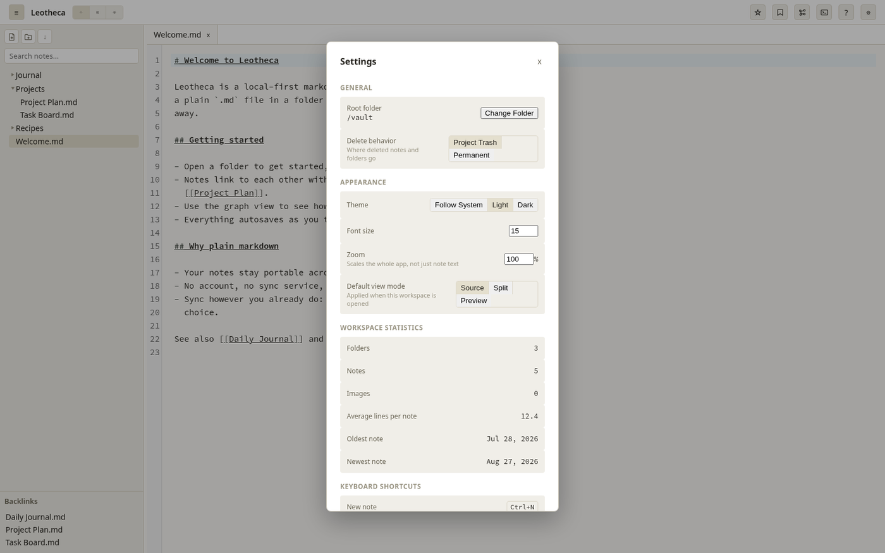

# Leotheca

A free and open source markdown viewer and editor for a local folder of plain text notes. No account, no telemetry, no proprietary sync, and no network calls of any kind, it runs fully offline.

[](LICENSE)
[](https://github.com/LeonardSchwier/leotheca/actions/workflows/ci.yml)


## Why this exists

Three principles govern every decision here, in order. Full detail in [`PHILOSOPHY.md`](PHILOSOPHY.md).

1. 🔓 **Free and open source, without compromise.** The full source is open under the MIT license, forever. No paid tier, no telemetry, no required account, no network calls at all, fully offline.
2. 🤝 **Standing on the shoulders of giants.** Where the wider note-taking ecosystem already has a good convention (wikilinks, YAML frontmatter, a folder of plain files), this project adopts it instead of inventing a competing one.
3. 📁 **Your notes belong to you.** Plain markdown files in a folder you control, not a database, not a proprietary format. Nothing about how a note is stored depends on this application continuing to exist.

## ✨ Features

- 📂 Point it at any local folder of markdown files, no import step, no proprietary format.
- 🗂️ File tree with create, rename, delete (to a `.trash` folder, not gone for good), and a right-click context menu.
- 📑 Tabs, autosave, source-mode editing (CodeMirror 6) with a rendered Preview and Split view.
- 🔗 `[[wikilinks]]`, resolved by filename, with autocomplete while typing and a backlinks panel.
- 🕸️ A pannable, zoomable graph view of your whole workspace.
- ⭐ Bookmarks for files and saved searches.
- 🎨 A premium, deliberate light and dark theme, following your OS by default.
- 📱 On Android, real folder access via the Storage Access Framework, point it at a folder your existing sync tool already manages.

See [`ROADMAP.md`](ROADMAP.md) for what's shipped so far in detail and what's still open.

## 📸 Screenshots

<p align="center"></p>

Split view: source and rendered preview side by side, with `[[wikilinks]]` resolved and a backlinks panel in the sidebar.

<p align="center"></p>

The graph view, showing how notes connect to each other via wikilinks.

<p align="center"></p>

Settings: theme, font size, whole-UI zoom, workspace statistics, and every keyboard shortcut in one place.

## 📥 Install

### Linux

- **AppImage** or **Flatpak**: download the latest release from [GitHub Releases](https://github.com/LeonardSchwier/leotheca/releases). Both are built from the same source and work across all major distributions (Arch, Debian/Ubuntu, Fedora, and others).
- **Flathub**: planned, not yet submitted.

### Android

- **Obtainium**: point it at this repository's [GitHub Releases](https://github.com/LeonardSchwier/leotheca/releases) to get update notifications and installs directly.
- **F-Droid**: planned, not yet submitted.
- **Direct APK**: download from [GitHub Releases](https://github.com/LeonardSchwier/leotheca/releases) and install manually.

Minimum Android version: API 29 (Android 10).

### macOS and Windows

Not yet available. macOS is planned via Homebrew, Windows via a direct download from GitHub Releases (no package manager or store for either). No build target exists for either platform yet, see [`ROADMAP.md`](ROADMAP.md).

## 🔄 Sync

Leotheca does not ship or bundle a sync service, and never will, see [`PHILOSOPHY.md`](PHILOSOPHY.md). Your notes are plain files in a folder, so point whatever sync tool you already use at that folder: [Syncthing](https://syncthing.net/), a WebDAV client, a generic cloud-synced folder, or anything else that syncs a directory. Leotheca does not need to know it is happening.

## 🛠️ Building from source

```sh
npm install
npm run tauri dev
```

Full setup instructions (system dependencies per platform, running tests, the Android toolchain) live in [`CONTRIBUTING.md`](CONTRIBUTING.md).

## 📚 More

- [`PHILOSOPHY.md`](PHILOSOPHY.md), the three principles behind this project
- [`ARCHITECTURE.md`](ARCHITECTURE.md), the solution architecture: how the two platform shells and the shared frontend fit together
- [`ROADMAP.md`](ROADMAP.md), what's built, what's next
- [`CONTRIBUTING.md`](CONTRIBUTING.md), how to set up a dev environment and submit a change
- [`CHANGELOG.md`](CHANGELOG.md), released versions
- [`CONSTITUTION.md`](CONSTITUTION.md), the binding rules and standing decisions for anyone (human or AI) working on this codebase

## 📄 License

MIT, see [`LICENSE`](LICENSE).
